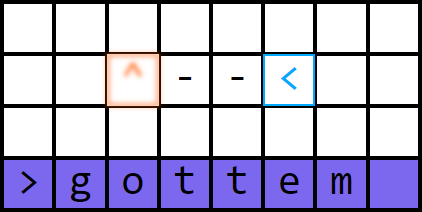
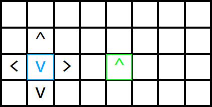
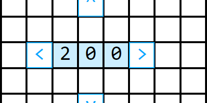
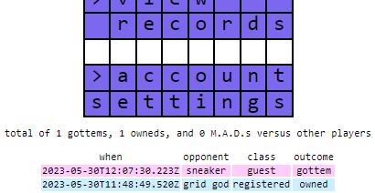

# GRIDCOOL
The multiplayer strategy game where all you have to do is aim directly at your opponent. Easy, right? Play it [here](http://grid.cool/).

&nbsp;

&nbsp;
## features
* ### gunfire

Move by either clicking the arrows or using your keyboard. Once your opponent is in your sights, you'll fire automatically, ending the match in an instant.

&nbsp;
* ### deception

There's no telling where your opponent will be, since they move at the same time as you...

&nbsp;
* ### fun (sometimes)

After your first match, create an account and set your signature color. This will be visible to opponents, so be sure to choose an insultingly garish hue.

&nbsp;
* ### player records

From your account, you can also check your match history, among other options. Try to raise your gottem/owned ratio.

&nbsp;
* ### reading this page
is not a real feature, so [go and try the game!](http://grid.cool/)

&nbsp;
## tech stack
* Javascript
* NodeJs
* Express
* Really, really should have used WebSocket but did not
* PostgreSQL
* Bcrypt
* AWS
* CSS
* HTML5
* axios